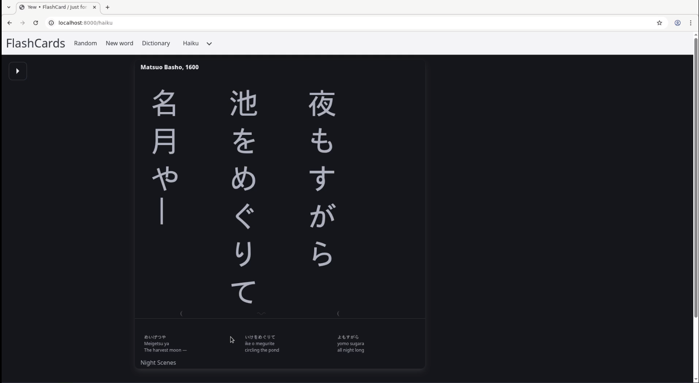

# FlashCards
mysqldump -u root -p --protocol tcp flashcards -R -e --triggers --single-transaction > database_backup.sql

Sort of totally useless project, allows me to create a tiny thesaurus and randomly reads a word to check if I remember it.

22/04
